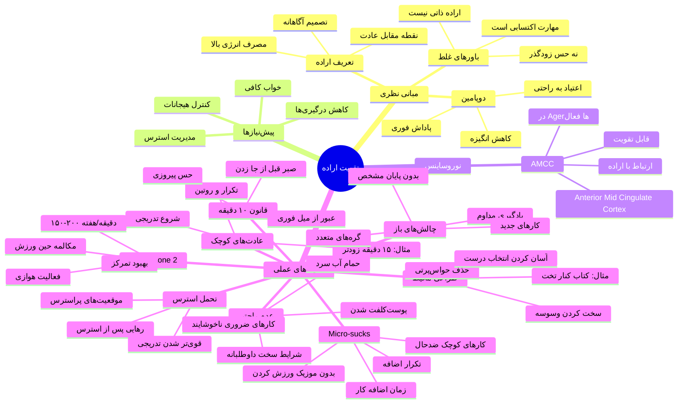

> [!abstract] **چکیده**
> اراده یک **مهارت قابل ساختن** است، نه یک حس زودگذر. برخلاف باور رایج، افراد منظم از سیاره دیگری نیامده‌اند؛ آن‌ها فقط سیستم‌ها و عادت‌های درستی ساخته‌اند.
> نکته کلیدی: به جای تکیه بر انگیزه لحظه‌ای، باید **سیستم‌هایی** طراحی کنیم که انجام کار درست را آسان و کار اشتباه را سخت کنند. اراده مانند عضله است - هرچه بیشتر تمرینش دهیم، قوی‌تر می‌شود.
> راز اصلی: انجام دادن کارهای سختی که دوست نداریم، نه فقط کارهایی که برایشان تشویق می‌شویم.

---

### ۱. تعریف اراده و تفاوت آن با عادت

**اراده** نقطه مقابل سیستم عادت‌هاست:

- **عادت**: انجام کارها با انرژی کم (چه خوب، چه بد)
- **اراده**: تصمیم آگاهانه برای ایستادن مقابل عادت‌های ناسالم یا اضافه کردن عادت‌های جدید مفید
- انجام کارهایی که نیاز به اراده دارند، انرژی زیادی مصرف می‌کند - به همین دلیل سخت است

### ۲. باور غلط درباره اراده

**باور غلط**: افراد منظم اراده آهنین مادرزاد دارند

**واقعیت**:

- اراده و انضباط **مهارت** هستند، نه حس
- می‌توان آن‌ها را ساخت و قوی‌تر کرد
- به جای اینکه انگیزه یک حس بی‌ثبات باشد، می‌توان آن را به یک **انتخاب آگاهانه** تبدیل کرد

### ۳. چرا عمل کردن به تصمیمات سخت است؟

**دوپامین و پاداش فوری**:

- مغز انسان به دنبال لذت و راحتی است - هرچه سریع‌تر، بهتر
- `دوپامین`: ماده شیمیایی که هنگام انجام کارهای خوشایند ترشح می‌شود
- فست‌فود، اینستاگرام، اسکرول کردن = دوپامین فوری
- **مشکل**: عادت کردن مغز به پاداش فوری و آسان → تنبلی و بی‌حالی → کاهش دوپامین پایه → بی‌انگیزگی

### ۴. پیش‌نیازهای اراده

قبل از تقویت اراده، باید این موارد را اصلاح کرد:

- **خواب کافی و باکیفیت**
- **مدیریت استرس**
- **کنترل هیجانات**
- **کاهش درگیری‌های ذهنی و فیزیکی**

> نقل قول از Andrew Huberman: "اگر در زندگی نمی‌دانید دارید چه کار می‌کنید و هیچ برنامه‌ای ندارید، اولین چیزی که باید درست کنید، خوابتان است."

### ۵. نوروساینس اراده: Anterior Mid Cingulate Cortex

**AMCC** (Anterior Mid Cingulate Cortex):

- قسمتی از مغز که ارتباط مستقیم با قدرت اراده دارد
- مسئول انجام کارهای سخت
- در دو گروه بسیار فعال است:
  1. افراد با اراده بالا که به موفقیت‌های بزرگ رسیده‌اند
  2. `Agerها` (افراد مسنی که جوان‌تر از سن واقعی به نظر می‌رسند)

**خبر خوب**: می‌توان با تمرین‌های خاص، این قسمت از مغز را قوی‌تر کرد

### ۶. تکنیک‌های عملی تقویت اراده

#### ۶.۱ طراحی محیط (Environment Design)

نقل قول از James Clear (نویسنده کتاب Atomic Habits):

> "آدم‌های منضبط خودشان را در شرایطی قرار می‌دهند که نیاز به استفاده زیاد از اراده نداشته باشند."

**استراتژی‌ها**:

- محیط را طوری بچینید که کمترین حواس‌پرتی ایجاد شود
- وسوسه شدن را سخت کنید
- انتخاب رفتار خوب را آسان کنید
- مثال: گذاشتن کتاب کنار تخت + نبردن گوشی به اتاق خواب

**نتیجه**: با چیدن درست سیستم‌ها، حتی در روزهای ضعف هم احتمال موفقیت بالاست

#### ۶.۲ عادت‌های کوچک (Small Habits)

- مغز عاشق کارهای روتین و تکراری است (انرژی کمتری می‌برد)
- مثال: مسواک زدن برای بچه‌ها اول سخت است، بعد عادت می‌شود
- **استراتژی**: با تغییرات کوچک شروع کنید، قدم‌به‌قدم پیش بروید
- مثال: برای بیدار شدن در ۵ صبح، از ۱۵ دقیقه زودتر شروع کنید، نه یک‌باره

#### ۶.۳ قانون ۰ دقیقه (10-Minute Rule)

**روش کار**:

- وقتی وسوسه می‌شوید کار خوب را رها کنید یا وسط کار سخت می‌خواهید جا بزنید
- **۱۰ دقیقه صبر کنید** و ادامه دهید
- بعد از ۱۰ دقیقه، اگر خواستید، می‌توانید متوقف شوید

**چرا کار می‌کند**:

- ۱۰ دقیقه آن‌قدر کم است که مغز وحشت نکند
- آن‌قدر طولانی است که از میل فوری عبور کنید
- اغلب بعد از ۱۰ دقیقه، حس پیروزی دست می‌دهد و کار را تمام می‌کنید

**مثال عملی**: ساخت ویدیو - هر ۲ دقیقه میل به رها کردن و دویدن وجود دارد، اما با قانون ۱۰ دقیقه، ویدیوهای بعدی راحت‌تر تمام شدند

#### ۶.۴ تمرین عدم راحتی (Embracing Discomfort)

**اصل کلیدی**:

> "انضباط یعنی انجام دادن کارهای ضروری حتی وقتی راحت و خوشایند نیستند."

**استراتژی‌ها**:

- خودتان را داوطلبانه در شرایط سخت قرار دهید
- هرچه بیشتر خلاف راحت‌طلبی مغز عمل کنید، قدرت تحمل بالاتر می‌رود
- مثال: حمام آب سرد صبحگاهی - شروع روز با کار سخت، بقیه روز آسان‌تر می‌شود

نقل قول از David Goggins:

> "هر روز یک کار سخت انجام بده که پوستت کلفت شود."

**نتیجه**: هر بار که مغز می‌بیند اتفاقی نیفتاده و قوی‌تر شده‌اید، دفعه بعد کمتر مخالفت می‌کند

#### ۶.۵ ورزش کاردیو Zone 2

**تعریف**:

- فعالیت هوازی که ضربان قلب در محدوده دوم از پنج محدوده قرار گیرد
- **تشخیص**: حین انجام فعالیت، بتوانید راحت با شخص دیگری مکالمه کنید
  - اگر نمی‌توانید = بالاتر از Zone 2
  - اگر خیلی راحت است = Zone 1

**مثال‌ها**:

- دویدن
- شنا کردن
- پارو زدن
- دوچرخه‌سواری

**توصیه**: ۱۵۰ تا ۲۰۰ دقیقه در هفته برای بزرگسالان

**فواید**:

- تقویت قدرت اراده
- بهبود تمرکز و حافظه
- دونده‌ها و ورزشکاران هوازی معروف به اراده قوی هستند

#### ۶.۶ Micro-sucks (کارهای کوچک ناخوشایند)

**تعریف**: انجام دادن کارهای کوچک ضدحال‌گونه

**مثال‌ها**:

- ورزش بدون موزیک (در حالی که عادت دارید با موزیک ورزش کنید)
- در ست آخر، ۲-۳ تکرار بیشتر انجام دهید
- بعد از اتمام زمان مطالعه/کار، ۱۰-۲۰ دقیقه بیشتر ادامه دهید، بعد گوشی را چک کنید

**نتیجه**: این کارهای کوچک در مجموع به شدت اراده را تقویت می‌کنند

#### ۶.۷ کارهای بدون پایان مشخص (Open-ended Challenges)

**تعریف**:

- کارهایی مثل بازی‌ای که پایان مشخصی ندارد
- دائماً با چالش‌ها و گره‌هایی مواجه می‌شوید که باید بازشان کنید

**مثال**:

- فعالیت ورزشی در یک حرفه برای بهتر شدن
- پایان مشخصی ندارد، ولی بین راه گره‌های زیادی وجود دارد

**ویژگی Agerها**:

- علاقه‌مند به انجام کارهای جدید
- خودشان را در چالش‌های سخت و تازه قرار می‌دهند
- مغز و بدنشان را با چالش‌های جدید درگیر می‌کنند

**نکته کلیدی**:

> "کارهایی را انجام دهید که برای شما سخت است، نه صرفاً کارهایی که دوست دارید یا برایشان تشویق می‌شوید."

#### ۶.۸ تحمل استرس

**مکانیسم**:

- انجام فعالیت پراسترس یا تجربه موقعیت استرس‌زا
- بعد از آن: دوره رهایی از استرس
- این تجربه باعث قوی‌تر شدن می‌شود
- مواجهه مجدد با همان موقعیت، راحت‌تر خواهد بود

**هشدار**: خودتان را در موقعیت‌های عجیب و غریب و پراسترس قرار ندهید، فقط بدانید تحمل استرس، اراده را قوی‌تر می‌کند

## نقشه ذهنی

---

## شناسنامه ویدیو

- **عنوان**: چطور قدرت اراده‌ی خودمون رو تقویت کنیم
- **کانال**: Arad Seyedin
- **تاریخ انتشار**: ۲۵ سپتامبر ۲۰۲۵
- **مدت زمان**: ۱۸ دقیقه و ۲۴ ثانیه
- **بازدید**: ۱۴۰,۹۱۲
- **لایک**: ۵,۹۲۳
- **دسته‌بندی**: People & Blogs

## لینک‌های مرتبط

- کانال دوم Arad: [@TRAINWITHARAD](https://www.youtube.com/@TRAINWITHARAD)
- اینستاگرام Arad: [@aradseyedinpersian](https://www.instagram.com/aradseyedinpersian/)
- کانال Khashayar: [@KhashayarTalks](https://www.youtube.com/@KhashayarTalks)
- باشگاه Vibe: [@vibelng](https://www.instagram.com/vibelng/)
