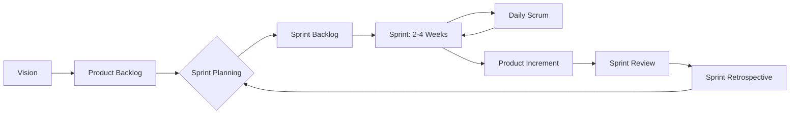

**user**: در چارچوب System Prompt بالادستی Vault عمل کن.

ورودی تو محتوای نوت فعال ({activeNote}) است که مربوط به یک جلسه از یک دوره آموزشی و قرارگرفته در فولدر همان دوره است. این نوت ممکن است خام، بدون ساختار، ناقص یا دشوار برای فهم باشد.

وظیفه تو بازسازی کامل این نوت به یک یادداشت آموزشی دقیق، شفاف، منسجم و قابل استفاده بلندمدت است؛ به‌طوری که بدون دیدن ویدئو یا جلسه، بتوان از روی آن یاد گرفت.

قبل از بازنویسی:

- موضوع اصلی و هدف آموزشی این جلسه را تشخیص بده
- جایگاه این جلسه را در کل دوره در نظر بگیر
- ارتباط معنایی آن با نوت‌های قبلی همان فولدر را حفظ و تقویت کن
- فرض کن هر فایل یک جلسه مستقل اما وابسته به جلسات قبل است

قوانین تکمیل محتوا:

- فقط در چارچوب موضوع همین جلسه و دوره غنی‌سازی کن
- مفاهیم مبهم، ناقص یا تلگرافی را شفاف و آموزشی کامل کن
- از افزودن مطالب عمومی، نامرتبط یا خارج از مسیر دوره خودداری کن
- اگر توضیح تکمیلی اضافه می‌کنی، آن را همسو با محتوای جلسه نگه دار

ساختار نهایی نوت:

1. خلاصه آموزشی جلسه (این جلسه چه چیزی را و چرا آموزش می‌دهد)
2. مفاهیم و نکات کلیدی جلسه (ساختاریافته)
3. توضیح دقیق و منظم هر مفهوم
4. ارتباط این جلسه با مفاهیم یا جلسات قبلی دوره
5. مثال‌ها، نکات کاربردی یا ساده‌سازی مفاهیم (در صورت نیاز)
6. چک‌لیست مرور سریع یا نکات یادگیری
7. سوالات یا نکات مهم برای ادامه دوره (در صورت وجود)

اصول نگارشی:

- فارسی روان، آموزشی و دقیق
- مناسب یادگیری و مرور در آینده
- بدون پرگویی و بدون ابهام
- خروجی در Markdown سازگار با Obsidian

تگ‌گذاری:

- برای مفاهیم آموزشی
- تگ‌ها داخل جمله قرار بگیرند
- خروجی که میدی باید شامل یکسری تگ مهم و ضروری از اون جلسه باشه
- مفاهیم مهم را با هشتگ به هم مربوط میکنیم و تگ میذاریم
- اگر به نوت‌های قبلی دوره مرتبط است، لینک معنایی بده با تگ گذاری های مرتبط و موضوعات مرتبط
- از تگ گذاری غیرضروری خودداری کن

اگر جلسه شامل مهارت، فرآیند یا تکنیک قابل اجراست:

- مراحل یا نکات عملی را شفاف و مرتب ارائه بده
- در صورت امکان از چک‌لیست استفاده کن

رفتار نهایی:

- شلختگی نوت خام را حذف کن، اما محتوای جلسه را تحریف نکن
- نوت نهایی باید منسجم، آموزشی و قابل اتکا باشد
- خروجی باید با نوت‌های قبلی دوره هم‌خوان و هم‌سطح باشد
  \[Timestamp: 2026/02/11 21:51:42]

**ai**: در ادامه، نوت خام جلسه بیست‌وپنجم با عنوان **«معرفی اسکرام»** بر اساس استانداردهای مدیریت دانش و ساختار درخواستی شما بازسازی شده است. این یادداشت به عنوان هسته مرکزی دوره، نقش یک **Master Note** را برای ورود به جزئیات فریم‌ورک اسکرام ایفا می‌کند.

---

# [[25. معرفی اسکرام]]

## ۱. خلاصه راهبردی جلسه

این جلسه نقطه عطف دوره و ورود به پرکاربردترین فریم‌ورک #مدیریت_چابک یعنی **اسکرام (Scrum)** است. هدف این جلسه، انتقال ذهنیت تیمی اسکرام، درک چرخه حیات یک اسپرینت و معرفی ساختار کلی «۳-۵-۳» (۳ نقش، ۵ رویداد و ۳ محصول) است. اسکرام نه فقط یک روش کار، بلکه سیستمی برای خلق ارزش مداوم در محیط‌های پیچیده از طریق همکاری تیمی (Swarming) است.

## ۲. مفاهیم و نکات کلیدی

- **فلسفه اسکرام:** الهام گرفته از راگبی؛ تمرکز بر حرکت جمعی و حمایت تیمی برای پیشبرد هدف.
- **ساختار ۳-۵-۳:** چارچوب اصلی اسکرام شامل ۳ نقش، ۵ رویداد و ۳ آرتیفکت (محصول).
- **واحد زمانی (Sprint):** بازه‌های زمانی ثابت ۲ تا ۴ هفته‌ای برای تولید خروجی قابل استفاده.
- **تغییر واحد تفکیک:** انتقال از ویژگی (Feature) در متدولوژی‌هایی مثل FDD به **داستان کاربر (User Story)** در اسکرام.

## ۳. توضیح دقیق و منظم مفاهیم

### الف) اسکرام چیست؟ (فلسفه وجودی)

واژه اسکرام از ورزش راگبی گرفته شده است؛ جایی که بازیکنان برای تصاحب توپ با هم متحد شده و به صورت یک توده (Swarm) عمل می‌کنند. در دنیای نرم‌افزار و مدیریت پروژه، #اسکرام به معنای این است که تمام اعضای تیم دست‌به‌دست هم می‌دهند تا از یک «ویژن» (Vision) محافظت کرده و آن را به محصول تبدیل کنند.

### ب) جریان کاری اسکرام (Scrum Workflow)

فرآیند تبدیل یک ایده به محصول در اسکرام به شرح زیر است:

1. **ویژن (Vision):** هدف غایی محصول (مثلاً: ساخت بهترین اپلیکیشن ویدیو با هوش مصنوعی).
2. **داستان کاربر (User Story):** ویژن به قطعات کوچک‌تر و معنادار از دید کاربر تقسیم می‌شود.
3. **بک‌لاگ محصول (Product Backlog):** لیستی اولویت‌بندی شده از تمام یوزر استوری‌ها.
4. **بک‌لاگ اسپرینت (Sprint Backlog):** انتخاب تعدادی از آیتم‌های بالای لیست (اولویت بالا) برای انجام در یک دوره زمانی مشخص.
5. **اسپرینت (Sprint):** چرخه ۲ تا ۴ هفته‌ای که در آن توسعه انجام می‌شود.
6. **خروجی (Increment):** محصولی که در انتهای اسپرینت «کار می‌کند»، حتی اگر کوچک باشد.

### ج) ساختار استاندارد اسکرام (Framework)

اسکرام بر پایه سه ستون اصلی بنا شده است:

| بخش | موارد |
| :--- | :--- |
| **۵ رویداد (Events)** | اسپرینت (ظرف اصلی)، برنامه‌ریزی (Planning)، اسکرام روزانه (Daily)، بازبینی (Review)، بازنگری (Retrospective) |
| **۳ نقش (Roles)** | مالک محصول (Product Owner)، اسکرام مستر (Scrum Master)، توسعه‌دهندگان (Developers) |
| **۳ آرتیفکت (Artifacts)** | بک‌لاگ محصول، بک‌لاگ اسپرینت، اینکرمنت (خروجی محصول) |

> [!info] فعالیت مکمل
> علاوه بر موارد بالا، فعالیتی به نام **Backlog Refinement** (شفاف‌سازی بک‌لاگ) نیز وجود دارد که در آن تیم به بررسی و آماده‌سازی آیتم‌های بک‌لاگ برای اسپرینت‌های بعدی می‌پردازد.

## ۴. نقشه مفهومی فرآیند (Mermaid)

## ۵. ارتباط با مفاهیم قبلی

- **تقابل با FDD:** در جلسات قبل دیدیم که [[FDD]] بر اساس Feature کار می‌کند، اما اسکرام بر اساس #User_Story (داستان کاربر) محصول را تفکیک می‌کند که نگاهی انسان‌محورتر دارد.
- **تکامل چابکی:** اسکرام در واقع پیاده‌سازی عملی اصول [[مانیفست چابکی]] است که در جلسات ابتدایی بررسی کردیم.
- **ارتباط با XP:** بسیاری از تیم‌های اسکرام از تکنیک‌های مهندسی [[XP]] (مثل TDD یا Pair Programming) در دل اسپرینت‌های خود استفاده می‌کنند.

## ۶. چک‌لیست مرور سریع

- آیا تفاوت بین **Review** (بررسی محصول) و **Retrospective** (بررسی فرآیند و تیم) را درک کرده‌ام؟
- آیا می‌دانم چرا به اسپرینت «ظرف رویدادها» می‌گویند؟
- مفهوم **Swarming** در همکاری تیمی برایم شفاف است؟
- تفاوت بک‌لاگ محصول و بک‌لاگ اسپرینت را می‌دانم؟

## ۷. سوالات مهم برای ادامه دوره

- نقش دقیق **Scrum Master** در حل چالش‌های تیم چیست؟
- چگونه اولویت‌بندی در **Product Backlog** توسط مالک محصول انجام می‌شود؟
- تعریف دقیق **Done** (انجام شده) برای یک اینکرمنت چیست؟

---

**تگ‌های مرتبط:**
#اسکرام #Scrum #مدیریت_پروژه #Agile_Framework #اسپرینت #تیم_چابک
\[Timestamp: 2026/02/11 21:52:37]
